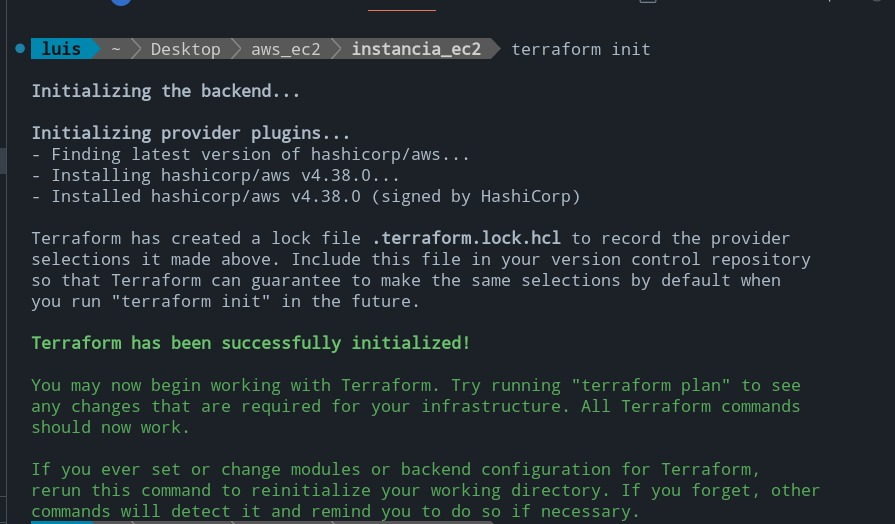
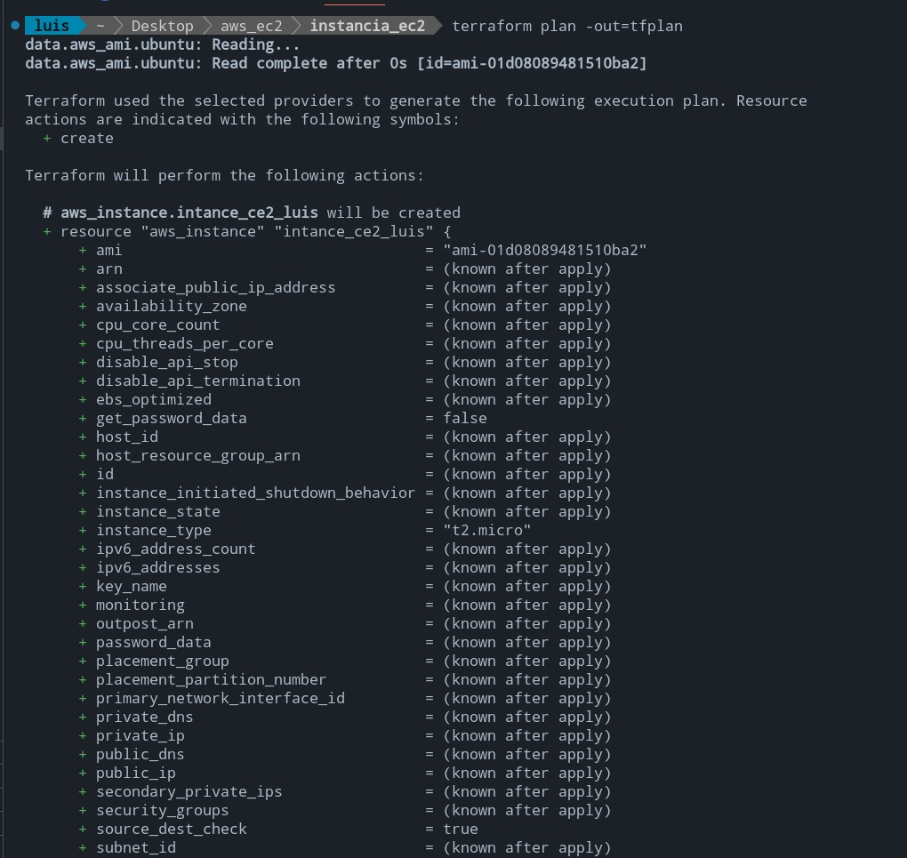
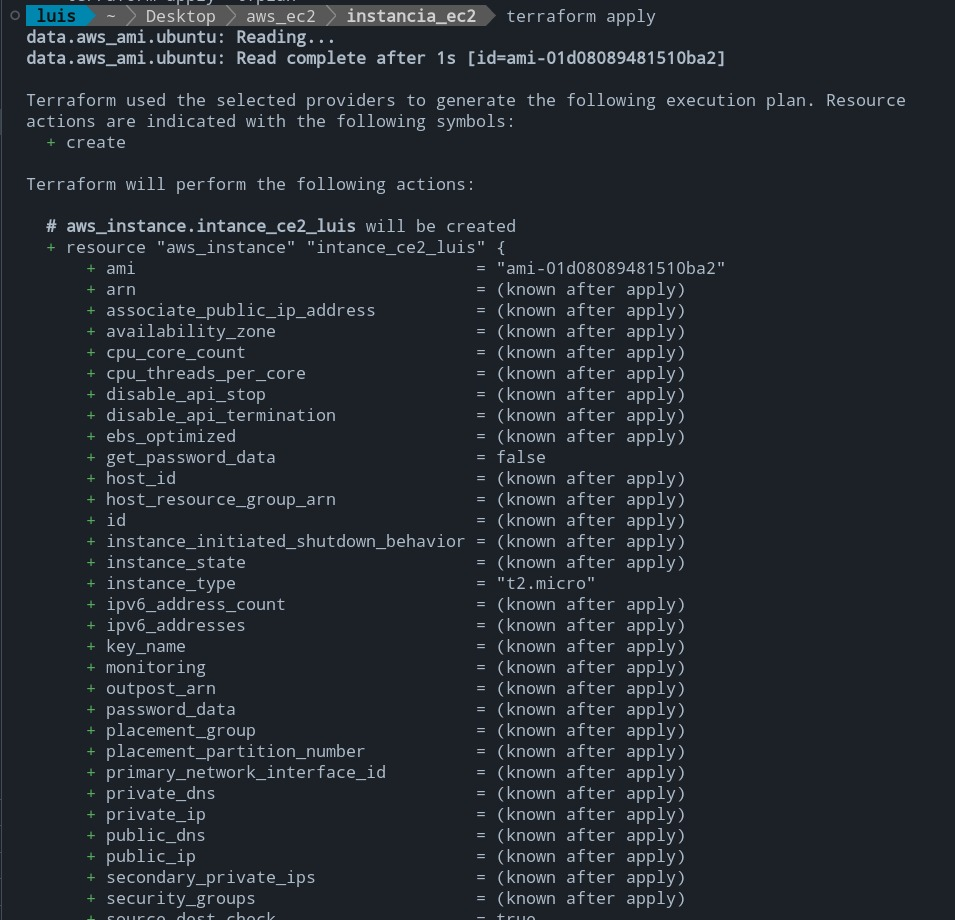
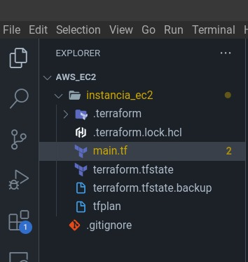
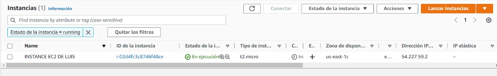
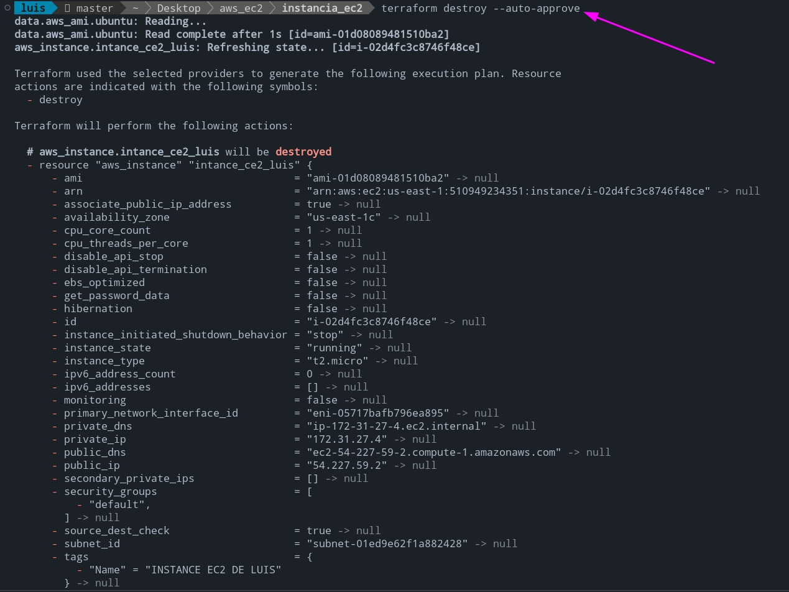
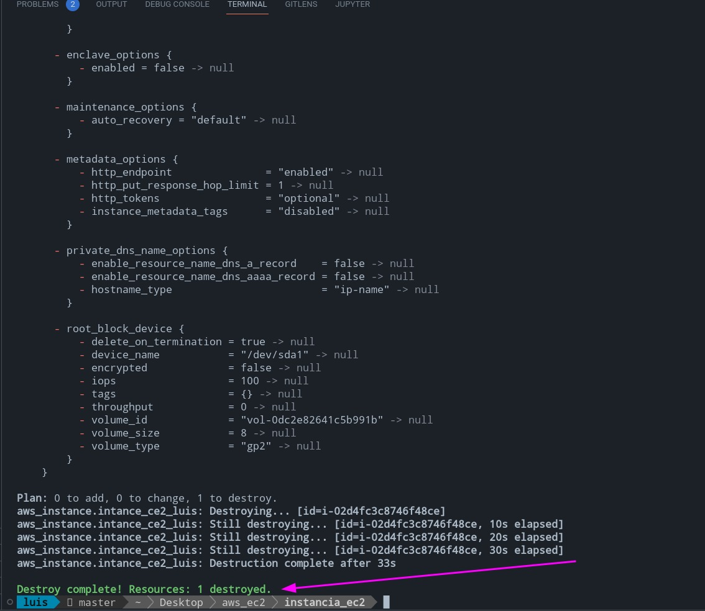

# Create aws CE2 instance with terraform

## What is Terraform?

<p>
HashiCorp Terraform is an infrastructure as code tool that lets you define both cloud and on-prem resources in human-readable configuration files that you can version, reuse, and share. You can then use a consistent workflow to provision and manage all of your infrastructure throughout its lifecycle. Terraform can manage low-level components like compute, storage, and networking resources, as well as high-level components like DNS entries and SaaS features.
</p>


## Project structure

```
.
├── instance_ec2
│   ├── main.tf
│   └── terraform.tfstate.backup
└── README.md

1 directory, 3 files
```

## Commands to create an instance

```
terraform init
```



```
terraform plan -out=tfplan
```



```
terraform apply
```




When the above commands are executed the following files will be created:

<br>



Now we can see in aws platform our created instance:

<br>



## Delete the CE2 instance

```
terraform destroy --auto-approve
```





